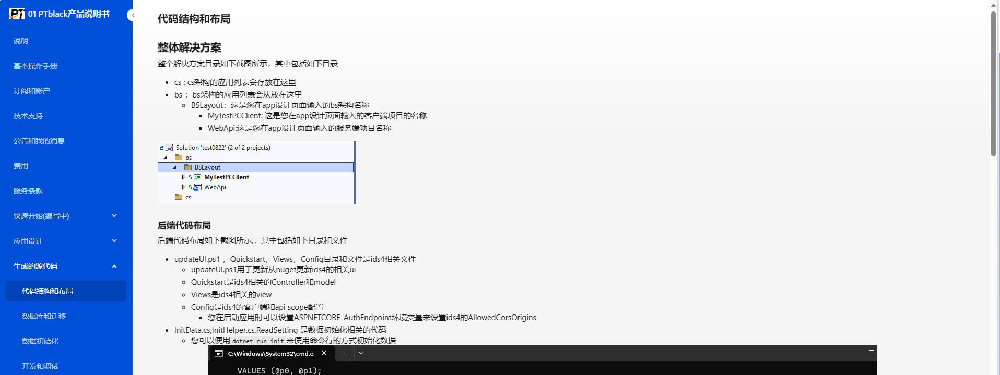

# MD文档库

## 背景
在我打算为[PTBlack](https://www.ptblack.cloud)产品编写文档的时候,需要一个可公开访问的文档库，因为我需要私有化部署，因此排除了paas产品。在github上查找了一阵之后没有发现合适的项目，因此决定自己写一个

## 效果
预览地址 : [https://doc.ptblack.cloud](https://doc.ptblack.cloud)

- 主页： 列出所有库，这里支持多个库


- 库详情：


## 如何使用
文档库文件存储根目录是wwwwroot/doc 

### 文档库
介绍如何设置文档库
#### 新建
在doc目录下创建一个目录作为您的新文档库，目录名称将作为文档库的名称
#### 排序
请将目录名命名为 ```[0-9]* 文档库1```的结构(例如:'```01 默认库```')，显示顺序将按照从小到大的顺序从左到右显示
#### 设置logo
在您新建的文档库目录内的根目录内添加名称为```logo.png```的文件，这将作为文档库的logo显示在主页
#### 设置文档库说明
在您新建的文档库目录内的根目录内添加名称为```setting.txt```的文件，此文件允许输入两行文本
- 第一行： 输入用户点击本文档库默认打开的文档，例如```01 说明```(这里需要输入文件的完整名称)
- 第二行： 输入文档库的说明

### 文档
介绍如何设置文档
#### 新建文件和目录
在文档库根目录创建目录或者后缀为.md的文件将作为此文档库的文档信息出现在文档库的菜单中，如果文件或者目录有排序字符将被过滤
#### 排序
将文件或者目录名命名为 ```[0-9]* 目录或文件名```的结构(例如:'```01 如何开始.md```')，菜单将按照从小到大的顺序显示
#### 支持的语法
除了基本的语法支持外：我们还支持以下语法
- [mermaid](https://mermaid.nodejs.cn/)
- katex

## 在docker中使用

听说翻墙是犯法的，因此无法push docker image .

