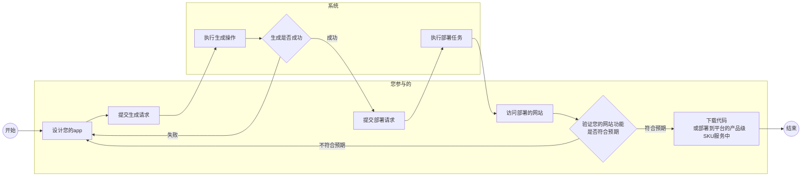

# PTblack产品说明书
## 这是用来做什么的
PTBlack是一个可以加快.net开发信息管理系统速度的工具，借助“app设计器”，您可以快速的设计出您的信息管理系统，并为您交付源码。
## 适合做什么
比如库存管理系统，考勤管理系统，客户关系管理，流程类等
## 能做到什么程度
-  拥有自定义的新建页面，允许自定义字段和自定义读取和写入脚本
   -  比如新建时可能需要记录创建时间，这时候可以设置写入脚本为datetime.now
   -  比如新建页面加载时可能需要显示一个单号，这时候可以设置读取脚本为datetime.now.tostring("yyyyMMddhhmmss")
-  拥有自定义的编辑页面，允许自定义字段和脚本
   -  和新建逻辑一样，区别在于设计读取脚本时可以访问当前数据对象的db数据模型
      - 比如您可能希望对将数据中createtime展示在编辑页面中，但是您不希望显示时分秒，则可以设置自定义读取脚本db.create.tostring("yyyyMMdd")  
 - 拥有自定义的删除页面，这部分不允许自定义过滤脚本
 - 拥有自定义查询页面，
   - 可以设置查询字段和自定义where脚本
   - 可以设置列表字段和排序，
   - 可以设置分页
   - 可以设置列读取的自定义脚本，这部分和编辑页的读取脚本类似
 - 拥有自定义的报表页面
   - 您可以设置报表块的查询语句，是否自动刷新等
   - 系统根据您的查询语句的返回值自动填充假数据并自动推荐可用的报表，这允许您在不了解报表类型时开发报表页面
 - 自定义写入页面（开发中）
   - 为什么需要这个页面:因为以上页面例如充值成功操作需要同时修改充值记录的状态和用户余额的情况 
   - 设计方案：通过自定义页面入参，读取脚本，写入脚本，页面元素的方式实现高度定制化
 - 工作流系统（开发中）
   - 为什么需要这个：信息管理系统大部分时候都有审批流类的业务，这部分功能是为解决这类业务而生
   - 设计方案：采用流程编辑器和业务编辑器集成的方式来自定义流程，让流程成为系统的一部分
     - 这让流程引擎和页面交互集合在了一起，与传统的流程引擎负责流程，业务引擎负责业务的方式不同，这更像k2 smart表单模式，但是他更强大
  - 支持的认证类型
    - 什么是认证类型：认证就是确认“你就是你”的过程，认证类型说的就是确认“你就是你”的不同方案
    - 账号密码型：这允许您的系统通过账号密码形式登录
    - oauth2.0(开发中)：这允许您对接支付宝，微信等开发平台的登录接口
  - 支持的授权类型：
    - 什么是授权类型： 授权就是授予某些人某些权限（可以授予某些实体的某系权限），而授权类型就是如何用什么方式管理授权
    - 无需授权：系统不需要管理权限
    - 预置角色模式的授权：这允许您在设计app时就定义好有哪些角色，然后在设计页面时选择页面所需的认证授权要求。此模型为：角色（多）-》用户
    - 预置权限的角色权限模式的授权:这与"预置角色模式的授权"类似，区别在于此模型为：权限(多)-》角色（多）-》用户
    - 自动-角色权限模式的授权：这与“预置权限的角色权限模式的授权”类似，模型也一致，区别在于此类型的权限是根据您的页面自动生成的，会为您的每个选择了“从操作生成”的页面生成对应的权限信息
***以上脚本编写时都拥有智能提示，采用与vs一致的智能感知服务***

## 基本使用流程
基本的使用流程如下（[请访问基本操作手册了解详情](02%20基本操作手册)）：

## 关于源码的说明
### 生成的代码架构
- 后端
  - net版本：net6
  - asp.net core web api
  - api 文档：swagger ui
  - 认证：ids4
  - 授权：自定义实现
  - 数据操作：efcore
- 前端
  - react
  - antd
  - antd pro

### 生成的代码中的授权控制
页面中所有的菜单，链接，按钮都根据当前用户角色信息自动显示或隐藏。
比如：您拥有a页面的访问权限，但没有b页面的权限，但是a页面到b页面有一个链接，则这个链接针对您将不可见。

## 关于平台托管的说明
平台仅支持托管b/s webui类型的客户端，不支持托管c/s架构的客户端。平台提供免费的托管sku和付费的托管sku,不同的sku提供不同标准的流量，cpu，内存参数。
### 平台托管提供的功能
- 快速部署
- 自动备份（双磁盘备份）
- 自定义域名绑定
- 手动数据恢复
- 流量控制
