# 开始
通过本手册，您将了解如何使用本服务来完成应用程序设计，生成，部署，预览，数据恢复基本操作。

## 设计应用
- 如何添加

  登录到PTBlack-LCG应用管理系统后，切换到“应用管理”菜单，在右侧有一个添加按钮，这可以添加一个新的app
  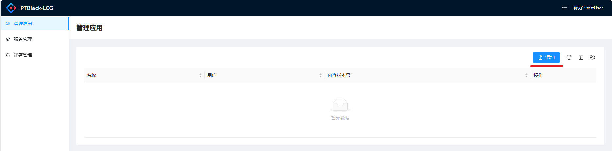
  如果您使用的是企业管理账号登录，则可以看到一个选择用户的下拉框，这表示您希望将此应用分配给企业账号下的哪个子账号使用。如果您是个人账号则无法看到此选项
  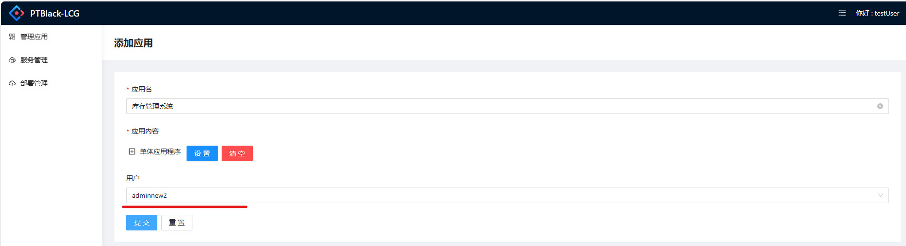
- 如何管理

  从app列表中可访问如下功能列表
  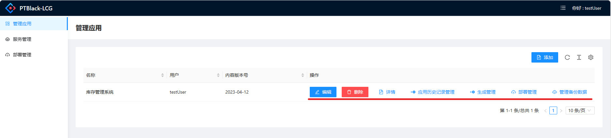
  - 编辑： 编辑您的app功能
  - 删除： 删除您的app
  - 详情： 查看app详情
  - 应用历史记录：
    app的每次保存操作都会生成一条历史记录，可以通过将某一条历史记录应用app的当前状态
  - 生成管理：
    管理您的生成记录，功能包括，添加，删除，查看生成日志等，详情参看[生成应用](#生成应用)
  - 部署管理：
    管理当前应用的部署记录，主要提供‘添加’功能用以创建新的部署请求，详情参考[部署应用](#部署应用)
  - 管理备份数据：
    管理您当前的app在多个部署环境中所生产的数据，每次部署都会生成新的备份数据，详情参考[管理应用数据备份](#管理应用数据备份)

更多设计器使用细节请参考[关于如何使用设计器的详细文档](/doc/02%20App设计器使用说明/快速开始)

## 生成应用
发起一个生成请求，服务将自动排队平处理您的生成请求，如果成功则会生成源代码和web部署包，web部署包可以作为部署内容使用。
### 生成流程
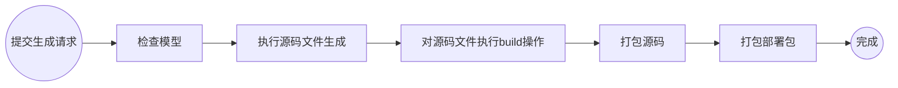
### 功能截图如下
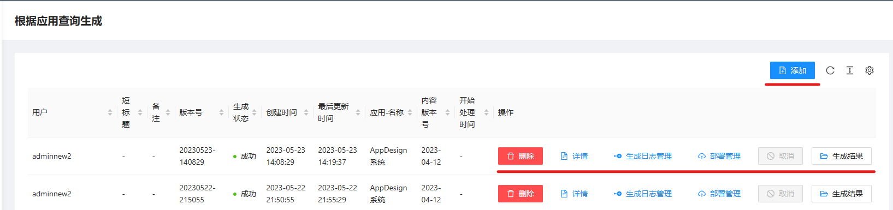
### 功能描述
  - 添加： 提交一个新的生成请求，平台会自动排队并处理请求
  - 删除： 删除该生成请求记录，
  - 详情： 查看生成请求的详情
  - 生成日志管理：

    生成过程会执行很多子任务，如果生成失败，可以在这里查看生成日志了解生成失败的原因
    
    - 可以根据'状态'查询快速查询哪些任务失败了
    - 可以点击'详情'查看具体的日志详情
## 部署应用
### 功能截图
部署记录列表，提供一组查询条件用来查询符合筛选条件的部署记录
点击“添加”进入新建部署逻辑
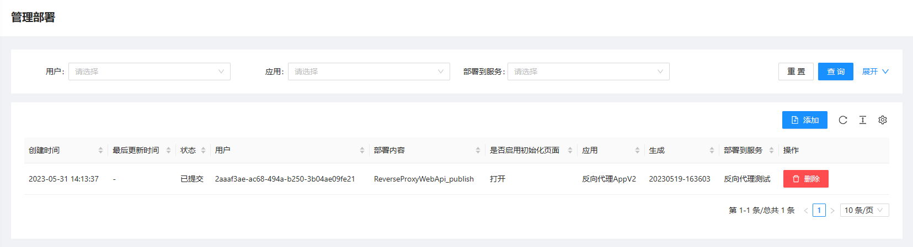
### 新建部署
添加一个新的部署请求，部署请求提交后，平台会处理此部署请求。平台处理部署请求的具体流程如下
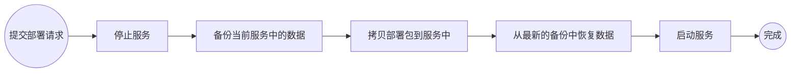
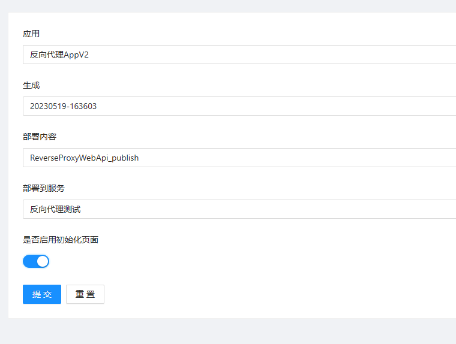

字段说明：
- 应用：选择要部署的应用，要部署的目标应用（如果从应用列表进入这个值会自动填入）
- 生成：选择要部署的生成记录，应用的生成记录（如果从生成列表进入这个值会被自动填入）
- 部署内容：选择要部署的部署包，应用的生成结果中可被部署的部署包
- 部署到服务：选择要将部署包部署到哪个服务上，
- 是否启用初始化页面：这是一个控制是否可访问数据初始化页面的选项，这是通过在启动应用时使用init -openInitWebUI 参数来打开初始化web页面可用
### 如何执行初始化
在部署时打开“是否启用初始化页面”选项可打开初始化web页面。通过访问`https://你的app域名/init/index`可进入初始化页面，在初始化页面按照页面提示输入信息来完成初始化过程，每次打开“是否启用初始化页面”选项的部署请求都可以使初始化页面可用（本次部署内只能使用一次），
- 初始化过程的截图

  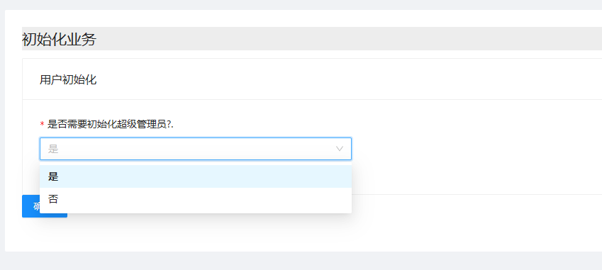
- 初始化完成后的截图

  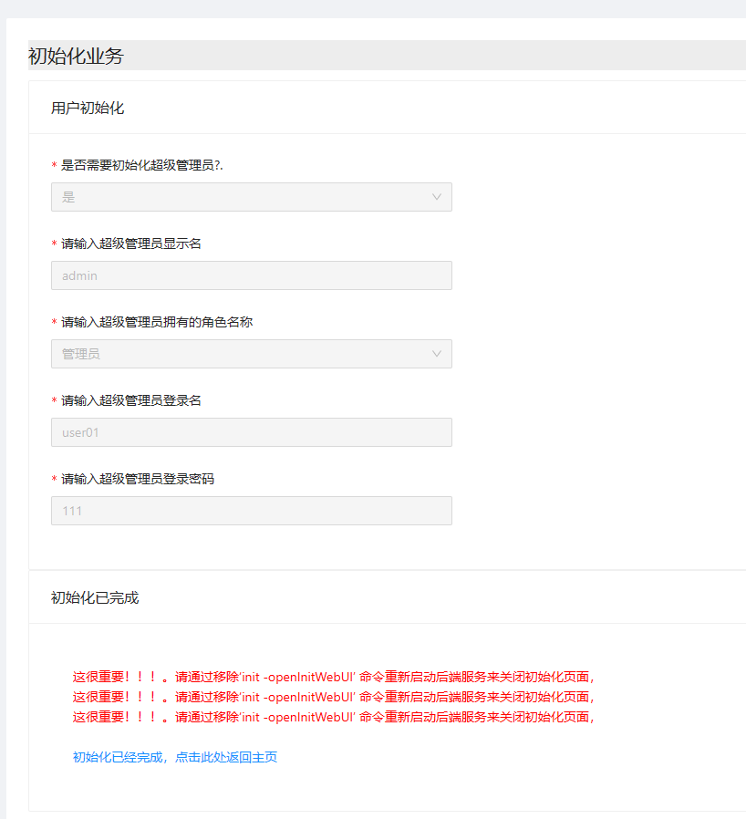
- 注意：

  如果初始化已经完成，虽然可用访问初始化页面，但已经无法执行任何初始化的行为，页面不在接受任何请求，因此即使不关闭初始化参数也不回引发安全问题。

## 管理应用数据备份
每次的部署之前都会先备份数据，生成备份记录，您可以通过手动方式将某一次备份数据应用到某个服务中。
- 版本的概念：数据的版本与生成数据的部署包所属的生成的版本号一致，服务的版本也与部署包所属的生成的版本号一致
- 只能将低版本的数据应用到高版本的服务中，不能将高版本数据应用到低版本的服务中
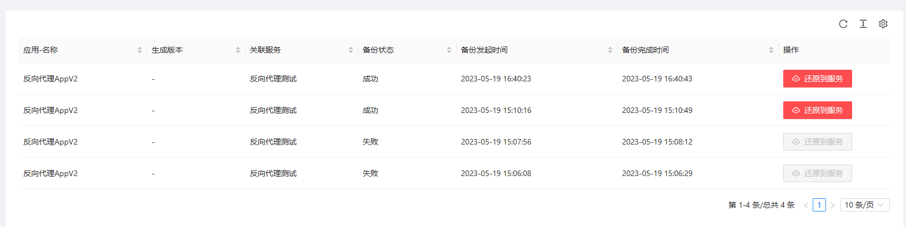

## 管理服务
服务是承载app的docker容器，服务有不同的sku，不同的sku拥有不同的参数。

| 参数     | 测试型        | 基本产品型    | 高级产品服务器 |
| -------- | ------------- | ------------- | -------------- |
| cpu      | 200           | 500           | 1024           |
| 内存     | 150mb         | 200mb         | 500mb          |
| 总容量   | 100mb         | 600mb         | 1g             |
| 流量     | 10 request/5s | 50 request/5s | 100 request/5s |
| 运行时间 | 3h/天         | 24h/天        | 24h/天         |
| 自动备份 | 无            | 每24h/次      | 每6h/次        |

### 添加服务
添加一个新的服务，这会为您分配一个新的docker容器
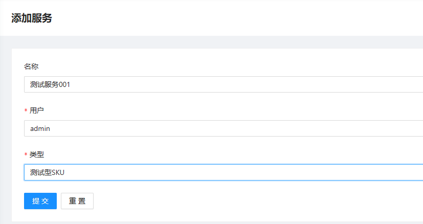

### 管理服务
可以通过服务列表页面对服务进行管理
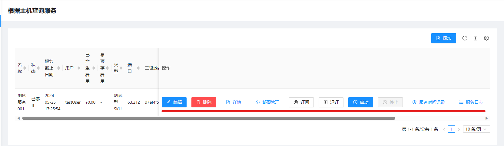
功能如下：
- 编辑：修改服务的sku
- 删除：删除服务
- 部署管理：查看当前服务关联的部署记录
- 订阅：为当前服务预充值
- 退订：如果不在需要服务，可将余额退还到账户
- 启动：启动当前服务
- 停止：停止当前服务
- 服务时间记录：这是服务运行的时间，这也是服务的消费详情
- 服务日志：对服务的操作日志，比如启动，停止，发布都会生成对应的服务日志

## 预览
当部署完成之后，您可以可以在您的服务列表中看到服务对应的二级域名，访问此域名，您可以预览您的app
