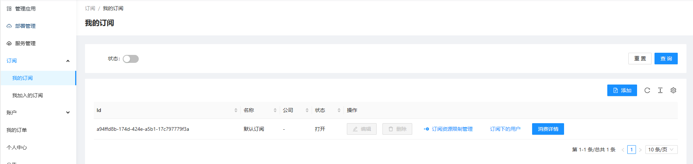
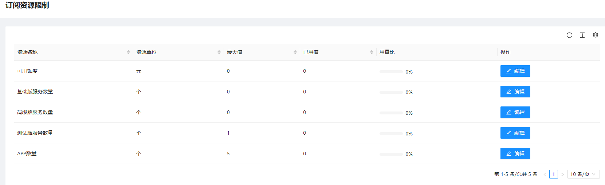

# 开始
订阅和子账户允许企业集中管理资源的使用，为不同的账户分配不同的订阅来实现资源的隔离。
通过本文档您将学会使用子账户和订阅来管理您的app，部署和服务

# 使用场景

## 让其他用户使用我的订阅
如果您是付费账户，则您拥有创建订阅和子账户的权限。您可以将已在本站登录过的账户添加为您的子账户，并将您创建的订阅分配给这个子账户，从而让此子账户拥有您分配的订阅的使用权。
如果您不希望此用户继续使用此订阅，可以删除订阅下的此账户，也可以直接删除此子账户。
这一功能可应用在人员离职的权限回收场景中。

## 回收其他用户对我的订阅的访问权限
您可以从“我的子账户”中删除某个用户，这样本用户将不能访问您的任何订阅
您可以从“我的订阅-》订阅下的用户”中删除此用户来回收此用户对当前订阅的访问权限

# 概念
- 订阅：是管理app、部署和服务的最小单位。每个订阅下维护着一组app、部署和服务。
- 子账户：是用来管理您的账户下拥有的子账户，可以将订阅分给您的子账户

## 订阅的资源限制
您可以管理您的订阅，并为每个订阅分配允许使用的资源最大值，例如此订阅最多可以创建多少个app，最多可以使用多少预存金额等。

## 免费账户
免费账户拥有一个默认订阅，不可删除。

## 注意
订阅内的数据是独立的，这意味着：不能将A订阅下的App1发布到B订阅下的Service1服务中。每个订阅之间的资源和数据是隔离的。

# 操作说明

## 管理订阅
在“订阅-我的订阅”允许您管理自己账户中的订阅，包括新建，编辑，删除，消费详情查看，资源限制管理，订阅下的用户管理操作
在“订阅-我加入的订阅”菜单下允许您查看您加入的订阅中的消费详情，资源限制，并可执行“退出”操作来主动退出本订阅

### 我的订阅
- 我的订阅 
- 订阅资源限制
- 订阅下的用户管理
- 在我的订阅下添加用户,注意这个列表是已经加入到子账户中的账号列表

### 我加入的订阅
- 我加入的订阅
- 消费详情

## 账户管理
在“账户-我的子账户”菜单下允许您管理加入到您账户下的子账户，这包括添加，删除操作等
在“账户-我加入的账户”菜单下允许您查看您加入的账户列表，并允许主动执行“退出”操作

### 我的子账户
- 我的子账户
- 添加一个子账户。将被添加的用户的id填入这里

### 我加入的账户
- 

