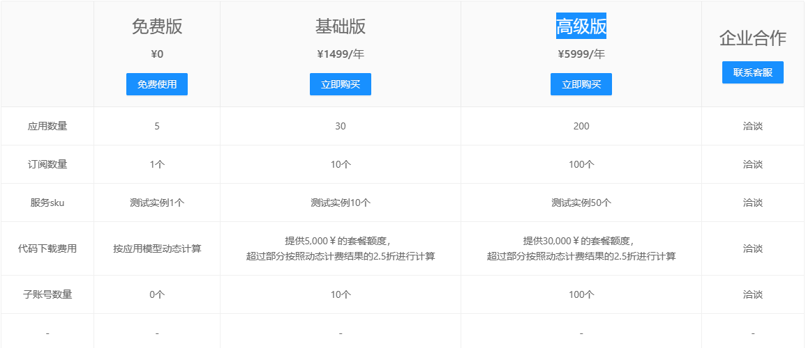
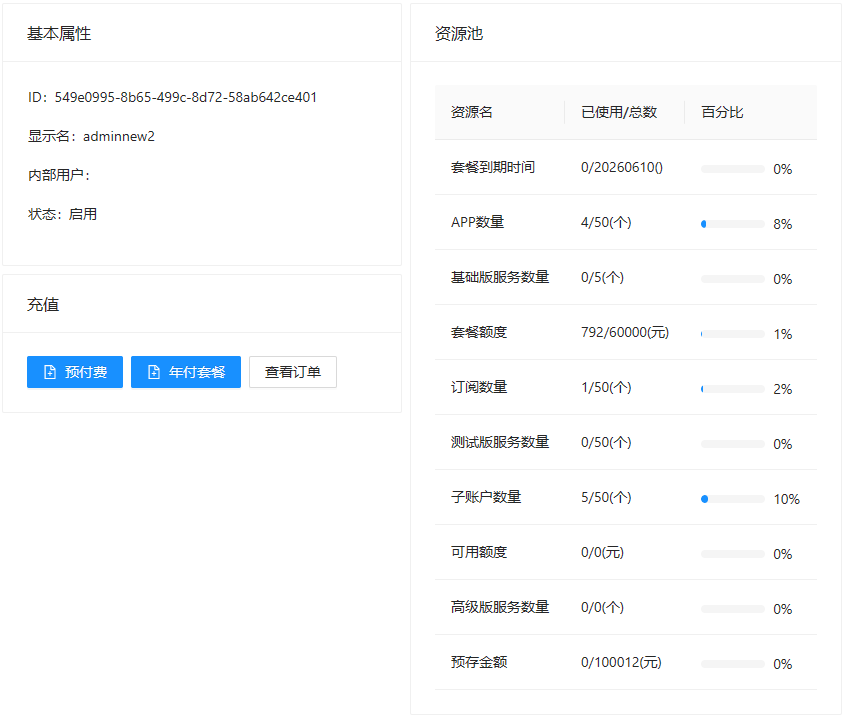
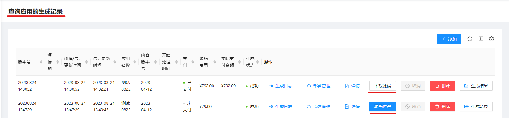
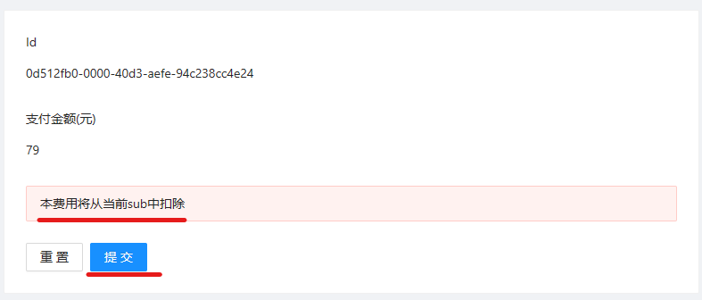
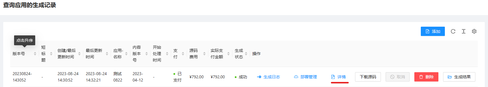
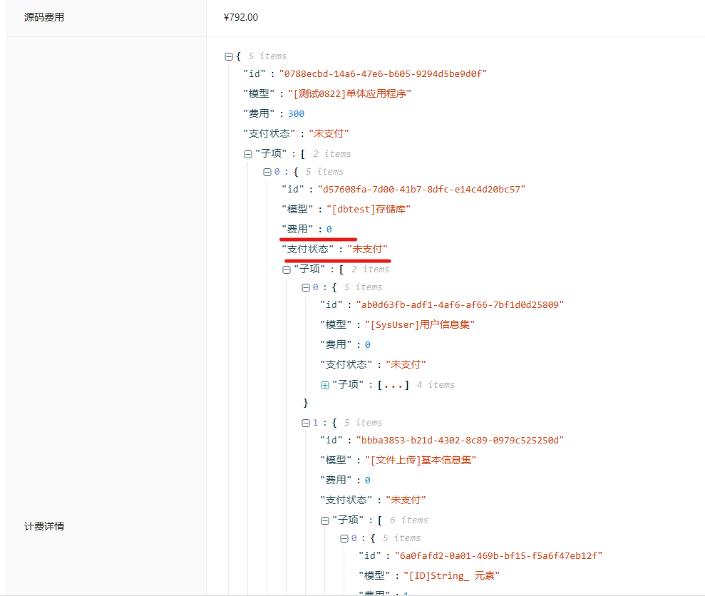

# 开始
本文档旨在清晰地说明充值和消费流程。

## 充值
为了购买我们的服务，您有两种充值方式可供选择：

### 预充值
- 预充值的金额将被存储为您的“预存金额”，该金额永久有效，不会过期。

### 套餐
- 套餐包括一组资源，如子账号、订阅、服务等，这些资源是有时效的。套餐自购买之日起计算，365天后资源将被清零。

## 消费
您可以在以下两种情况下发生费用：

### 源码下载费用
- 如果您需要下载当前版本的源代码，费用将适用。

### 服务实例费用（暂未开放）

## 套餐
我们提供年度套餐，其中包含了应用数量、测试服务实例数量、可用额度等资源。年度套餐在本年度内有效，过期后将自动失效，包括套餐额度也将清零。

### 如何购买套餐
1. 登录系统后，在左侧菜单列表中点击“个人中心”。
2. 在个人中心页面中，点击“年付套餐”以进入套餐购买页面。
3. 购买成功后，您可以在“个人中心”页面的“资源池”面板中查看资源的变化。

## 预充值费用
请参考[套餐费用>如何购买套餐](#如何购买套餐)，然后选择“预付费”进行购买。

## 源码下载费用
当您在本站设计、生成并部署验证应用后，如果需要下载当前版本的源码，将会发生费用。

### 付费方式
费用支付可以通过以下步骤完成：
1. 点击源码下载页面上的“支付”按钮。

### 扣款方式
点击“支付”后，您将被重定向到扣款页面。费用将从当前订阅所属账户的余额中扣除。如果套餐额度不足，余额不足的部分将从“预存金额”中按折扣进行扣除。

### 收费规则和标准
- 源代码基础费用为150元，覆盖整个基础代码。
- 页面费用：每个页面的基础费用为5元。
- 页面元素费用：根据页面元素的数量和类型计算，普通元素1元一个，其他元素可能为2元。
- 相同应用相同元素ID在不同的生成记录中不会重复计费。例如，如果您已经为上一次的生成付费，然后在应用的某个页面上添加了一个页面元素，费用为1元，那么重新生成后，本次源码包的费用将增加1元。

### 费用详情
在生成记录中点击“详情”以查看费用明细。费用明细列出了当前需要支付的项目，说明了哪些项目需要支付费用，哪些项目在上一次购买中已支付。

## 服务实例费用
（此部分暂未开放，将在将来提供详细信息。）
