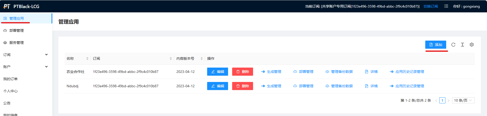
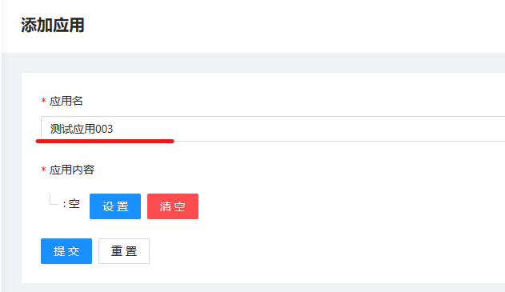
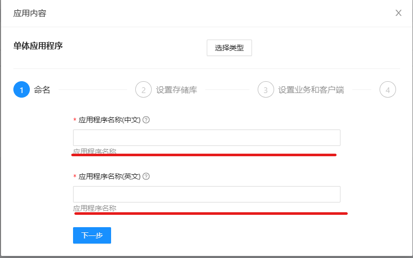

- 1 在菜单“应用管理”页面选择“添加” 
- 2 设置应用名称 
- 3 接下来您将点击“设置”按钮进入app的设计页面
- 4 点击“选择类型”按钮选择应用类型 
- 5 点击“使用这个”按钮创建“单体应用程序” 
- 6 输入应用名称,这里的名称与步骤2中的名称不同，这里是此应用最终运行起来时应用的ui中显示的名称，英文名作为其源代码的跟目录名 
- 7 点击“下一步”进入存储库设置，请看下一节