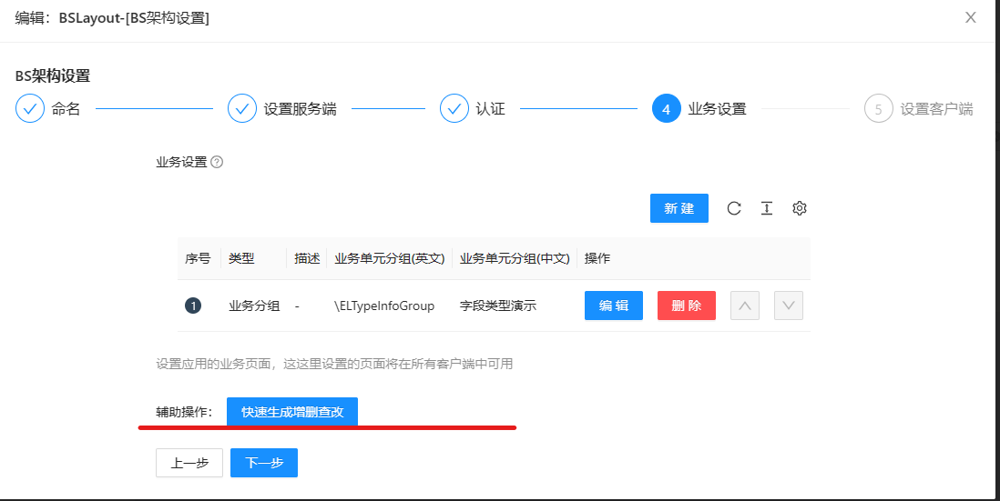
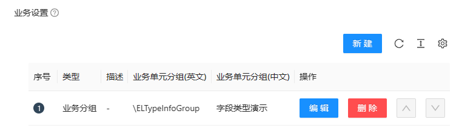

设计器指的是您在“编辑应用”页面点击“设置”打开的弹出层，这部分就是应用设计器。应用设计器是用来设计应用信息的工具。
设计器的本质是一个复杂json编辑器，最终他会产生一个json类型的数据。
## 如何保存
在使用设计器设计app时，***只有如下地方的点击才能实际保存设计结果，其他任何时候不会保存结果***
 
 
 ## 属性为对象
 如果您看到如下截图的内容，则表示此属性是一个对象,对象有三部分组成， 

 
 - 第一部分有个加号，可以预览当前对象的内容
 - 第二部分是设置按钮，点击之后可在新的弹出层中修改此对象
 - 第三部分是清空按钮，这将本对象设置为空 
 

 ## 编辑对象
 当点“设置”打开对象编辑器之后，您可能看到如下截图,其中从上大小您看到两个重要的部分
 - 第一部分：类型选择，一个对象可能存在多种变体，这时需要您根据您的业务需求选择一个特定的类型进行编辑
 - 第二部分：按步骤编辑进度条，当您已经选择了特定的类型，我们可能会为您展示进度条，来引导你完成编辑工作，有部分简单对象不提供进度条功能
 - 在完成当前进度节点的编辑工作之后，点击“下一步”。最终您需要点击“提交”来应用本次设置的更改。
   - ***更改的数据将应用到上级对象的属性中，如果上级对象最终也没有保存，则更改也不会生效***
 - ***在点击“提交”之前关闭弹出层，都不会更改数据***
 
 - 如果在某个进度节点出现“辅助操作”的列，则表示您可以使用辅助操作来帮您快速完成本节点的app编辑工作，“辅助操作”为简化编辑工作
 - 执行辅助操作会为您设置当前节点的数据，这些数据您也可以自己就更改，数据的保存最终还是需要您点击“提交”按钮才能生效
   

## 属性为集合
如果属性为集合您将看到如下截图的页面，您可以做添加，删除，编辑，调整顺序的操作
