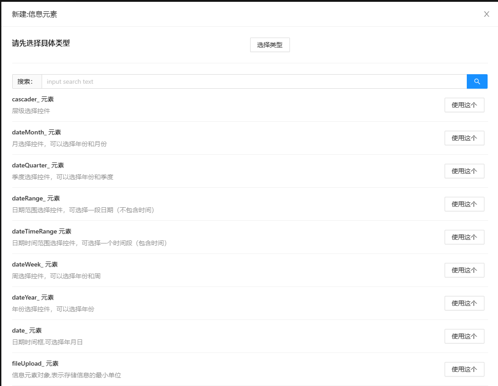
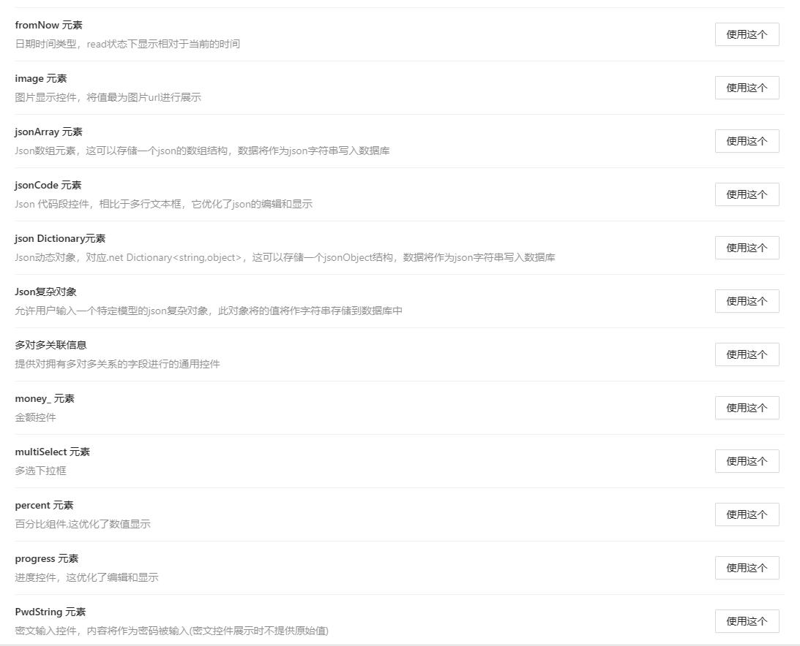
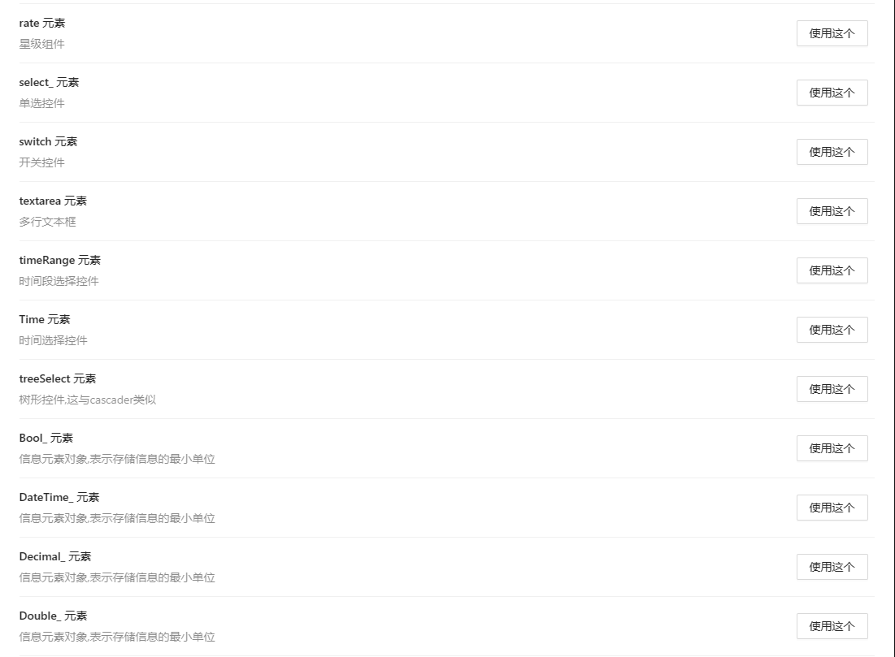
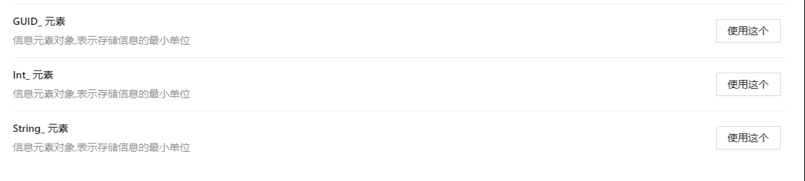

信息元素是存储实体属性的最小单元，信息元素是一组字段的模板，一个信息元素可能对应了多个数据库中表的字段，这和信息元素的类型有关，大部分信息元素与数据库中的表字段是一一对应的。
，比如存储季度类型的信息元素，在表中拥有年份和季度两个列，用来存储哪年哪个季度

# 具体支持的类型：

- 类型的使用效果可以访问：[类型演示程序](https://6bc5e44b7f564a5b9ee19f219a509203.ptblack.cloud/ELTypeInfoGroup/ELTypeInfoSearchPage) 来了解
- 另外您可访问[类型演示程序源码](https://gitee.com/dongdongv3/example-of-ptblack-field-type)了了解更多细节
  
- 以下是支持的类型列表 
  

