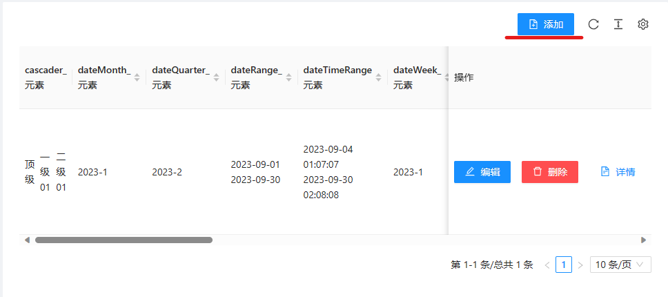
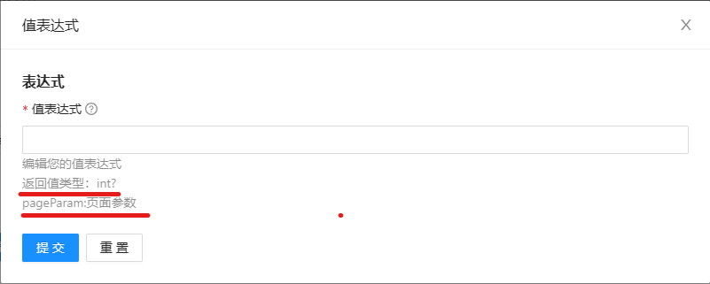

业务设置中首先是设置业务分组，业务分组就是将同一业务的操作放在一个组中，比如对订单的CURD操作都在订单业务组中

# 业务分组

使用业务分组来管理功能块，将同一业务类型的操作放在同一组业务中，来实现分组管理。
- 业务单元分组(英文)： 目前，同一业务组的功能函数会在同一类中，此值也将作为功能类的前缀
- 业务单元分组(中文)：此值将作为业务功能类的注释存在，当使用"自动-角色权限模型"时，此值作为权限分组的组名

# 设置页面
页面也是操作，或者叫做业务单元，目前支持的操作类型有
- 添加业务：用来添加数据
- 编辑业务：用来编辑数据
- 详情展示业务：用来展示数据详情
- 信息检索业务：用来查询数据
- 报表业务：用来显示数据的报表
- 自定义读写业务（开发中）
- 流程业务（开发中）
所有业务单元必须设置以下属性
- 业务单元英文名：此值用作业务单元在源代码中的函数名称，文件名称等
- 业务单元中文名: 此值将用作业务单元在源代码中的注释，权限名称等
- 操作的权限控制: 此值用来设置当前业务单元的认证授权控制方式，可选的值将在应用中选择的"认证信息集"中的认证授权类型的不同而不同
- 业务标题:此值将作为页面在前端的标题值
  
## 添加业务
除了页面的基本设置外，您需要设置以下属性
- 目标表：设置需要将数据新增到的目标表
- 业务入参设置：这是设置此业务需要的页面入参，参数可以是必填或者选填，这里的参数在自定义读取或写入逻辑时可以访问到，可访问[业务参数](05%20业务参数)了解更多
- 页面字段：设置添加页面需要哪些字段，每个字段需要设置以下属性
  - 字段：选择目标表的某一个字段，
  - 是否显示UI：这是一个下拉框，类型“不输出”表示在页面显示时api不会返回该字段的值，其他类型api都会返回此字段的值
  - Ui显示控件：这是设置页面中的ui控件的类型，***当您选择一个“字段”时，此值自动填充，当您更改“字段”的选项时，请点击这里的清空来重新自动重新生成属性***，否则页面ui将出现错误
  - 是否必填：设置此值是否必须填写
  - 读取时的数据表达式设置：如果“是否显示UI!=不输出”则可设置此字段在展示时的数据输出表达式，默认不设置返回空，如果您需要一个其他值，请在此设置自定义表达式
  - 写输入时表达式：
    - 如果“是否显示UI==不输出”，则此字段必须设置表达式，
    - 如果“是否显示UI!=不输出” 可以不设置此值，默认将用户输入的内容写入到数据库，如果设置了自定义表达式，则值的写入按照您的表达式执行
  -  自定义验证： 这可以对用户输入的内容进行有效性检查的检查规则。 在果“是否显示UI==不输出”时不需要设置此值

## 编辑业务
编辑业务的设置和添加类似，区别在于编辑的“读取时的数据表达式设置”中允许访问db对象。另外您还可编辑如下属性
- 连接设置：用来设置一个链接到别的业务的按钮，具体参考[如何设置链接](#如何设置链接)
- 操作的启用条件：此设置用来控制操作在什么时候启用，比如状态不为草稿时不允许修改等。***这部分也是.net脚本，工作在服务端***，脚本必须返回bool值，可以访问db对象

## 详情展示业务
与添加业务类似，区别是不需要设置写入脚本，因为此页面只有读取操作。另外您还可以设置如下属性
- 连接设置：用来设置一个链接到别的业务的按钮，具体参考[如何设置链接](#如何设置链接)
- 操作的启用条件： 与编辑业务中的功能一致，用来控制操作的启用条件

## 删除业务
除了页面的基本设置外，您还需要设置如下属性，要删除的目标对象的匹配字段
- 要删除的目标对象的匹配字段 ： 此字段用来表示您的删除时的数据匹配的字段，此字段将作为业务入参。其他业务要链接到本业务必须提供此参数
- 操作的启用条件： 与编辑业务中的功能一致，用来控制操作的启用条件

## 信息检索业务
除了页面的基本设置外，您还需要设置如下属性
- 设置目标表： 设置需要查询的表，支持多表关联查询，支持两种设置方式
  - 简单模式：您仅需设置需要关联查询的表，系统自动根据表关系推断关联查询语句，对于设置了[信息集关系](../01%20存储库/01%20信息集)的表来说，用这种最简单
  - join设置：这需要您设置一个主表，然后设置join表和条件，这在没有设置[信息集关系](../01%20存储库/01%20信息集)时使用，是一种相对难度更大的用法
- 列表需要展示的信息：设置查询页面的表格需要展示的列的信息，列信息支持"读取时的数据表达式设置"功能
- 默认排序列和默认排序方式：用来控制页面打开时的默认数据排序列和排序方式
- 查询条件：用来设置查询页面拥有哪些查询条件，比如根据类型查询等。每一个查询条件您可以设置如下属性
  - 字段：数据过滤条件的工作字段
  - 是否显示UI：用户是否参与此查询条件的输入，这部分可参考“添加业务”的此字段。
  - 读取时的数据表达式设置：在"是否显示UI!=不输出"时可用，设置页面在加载时的显示的数据的脚本，***此处是.net脚本，工作在后端。***
  - 过滤规则：设置过滤条件，针对一个字段可以设置一组过滤条件，这些条件按照and的方式链接。设置一个过滤规则您需要设置如下属性
    - 生效条件：设置此过滤条件的生效规则，比如我们一般希望用户的输入不为空时才执行过滤，而不是总是执行过滤
    - 过滤逻辑：设置数据过滤表达式，当表达式的值为true时数据将被展示。***此处是.net脚本，工作在后端，脚本必须是可被转换为sql的linq或者lamud表达式***
  - 分页设置: 设置查询列表是否需要支持分页，默认为10条每页，可点击清空来关闭分页，这将列出所有数据，如果数据量比较大，建议开启分页
  - 链接到其他业务：设置在查询页面需要链接到其他业务的链接按钮，比如查询页面一般需要链接到添加业务中
    - 
  - 从行上链接到其他业务:也是链接到其他业务，区别是此链接将为每行数据生成业务链接，这种链接可以访问到展示在前端的行数据

## 报表业务
除了页面的基本设置外，您还需要设置如下属性
- 报表项：设置报表页面需要包含哪些报表项目。设置报表项需要设置以下属性
  - 报表项英文名：这将作为报表项的相关代码的变量和函数名称前缀或后缀使用
  - 报表项中文名：这将作为报表项的标题使用，每个报表项都应该有标题，标题会展示在页面中
  - 刷新频率(s)： 设置报表项的自动刷新频率，默认为空不刷新
  - 宽度/高度： 设置报表在页面中的宽度,可以是任务有效的css宽度高度语法，如20%，20vh,20vw，20px等
  - 报表内容： 设置报表数据的查询脚本，系统将自动根据您的查询脚本生成测试数据，并为您列出与此数据匹配的报表类型，***此处是.net脚本，工作在后端。***
    - 您可以选择“自动”来在运行时自动根据数据信息匹配最合适的报表
    - 您可以选择特定的某个报表类型
    - 注意：在查询结果非常少时有时候有些报表可能无法渲染。

## 如何设置读取表达式
读取表达式工作在后端服务上，表达式是一段.net脚本，在从后端返回数据时，表达式将作为赋值语句的右侧表达式内容来工作，如果信息元素为多个字段，则您可以分别设置每个字段的值。
在表达式中您可以访问页面入参，如果您是编辑页面，您还可以访问当前已经查询到的数据对象。可访问的变量列表根据上下文的不同而不同，具体参考页面上的列表

## 如何设置写入表达式
写入表达式和读取一样，区别在于此脚本是工作在数据写入函数中，如果您有用户输入，则可以访问到用户输入的值。可访问的变量列表根据上下文的不同而不同，具体参考页面上的列表

## 如何设置链接
链接是业务到业务的导航，这包括导航按钮的样式，导航时的参数，导航的启用条件等。
可以设置如下属性
- 目标业务: 链接到哪里
- 按钮名称
- 参数映射：这里必须设置目标业务的必填入参，否则无法保存成功。参数映射需要填写以下属性
  - 目标参数：设置要映射的目标业务参数
  - 表达式:设置对参数赋值的表达式，***此表达式为前端js脚本，工作在前端***
- 按钮类型：控制按钮样式
- 是否危险操作：控制按钮样式
- 是否启用背景色透明：控制按钮样式
- icon选择：控制按钮的图标，不设置则按钮不显示图标
- 操作的启用条件：控制按钮是否启用，***此处是js脚本，工作在前端***，可访问前端的数据上下文数据。
- 业务成功后跳转：日志跳转的目标业务后，目标业务操作成功后的跳转方式，比如我跳转到添加业务，添加成功后应该返回到哪里，这里支持两种方式
  - 后退：后退指定次数，
  - 跳转到指定业务单元：业务成功后跳转到特定的业务单元中
