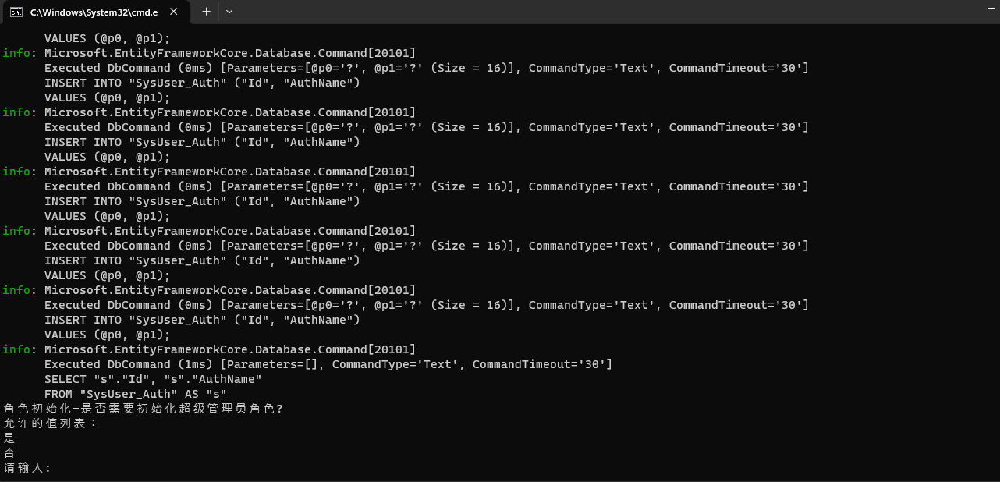
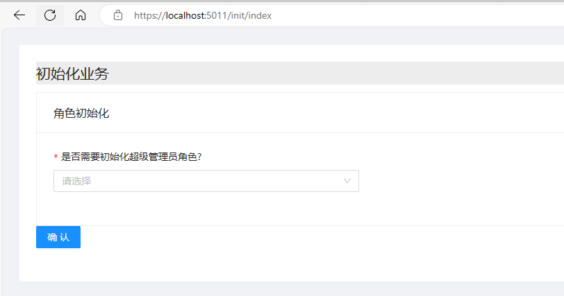

# 整体解决方案
整个解决方案目录如下截图所示，其中包括如下目录
- cs : cs架构的应用列表会存放在这里
- bs ：bs架构的应用列表会从放在这里
  - BSLayout：这是您在app设计页面输入的bs架构名称
    - MyTestPCClient: 这是您在app设计页面输入的客户端项目的名称
    - WebApi:这是您在app设计页面输入的服务端项目名称


## 后端代码布局
后端代码布局如下截图所示,，其中包括如下目录和文件
 - updateUI.ps1 ，Quickstart，Views，Config目录和文件是ids4相关文件
   - updateUI.ps1用于更新从nuget更新ids4的相关ui
   - Quickstart是ids4相关的Controller和model
   - Views是ids4相关的view
   - Config是ids4的客户端和api scope配置
     - 您在启动应用时可以设置ASPNETCORE_AuthEndpoint环境变量来设置ids4的AllowedCorsOrigins
 - InitData.cs,InitHelper.cs,ReadSetting 是数据初始化相关的代码
   - 您可以使用```dotnet run init```来使用命令行的方式初始化数据
     - 
   - 您可以使用```dotnet run init -openInitWebUI```来使用Web页面的方式执行初始化启用应用程序后访问“/init/index”路径进行初始化
     - 
     -  
 - Controllers中存放了webapi
 - Code目录中包含通用代码，接口定义，服务实现等
 - Migrations是efcore每次的生成的迁移代码


## 前端代码
前端代码布局如下截图所示，这是一个标准的antdpro react项目

