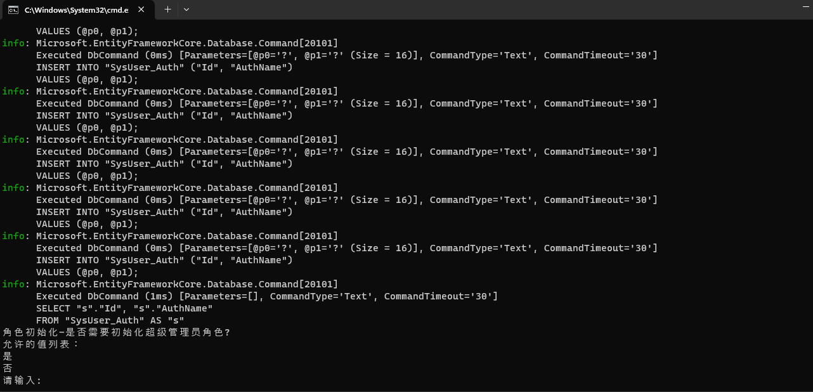
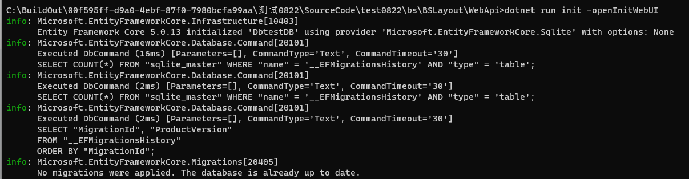
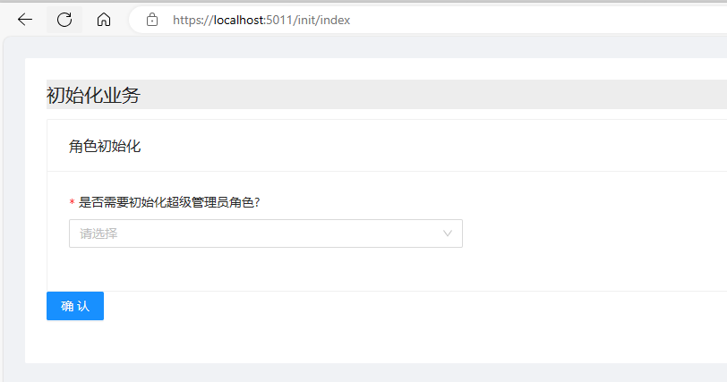

我们提供三种方式执行数据初始化工作，分别是
-  命令行交互模式初始化
-  命令行加载配置文件初始化
-  从webui中执行初始化

## 命令行交互模式初始化 
在命令行执行脚本```dotnet run init```会启动初始化过程，控制台会提示您应该输入什么内容，在最后一步会提示您是否需要生成初始化配置文件。配置文件可作为 “命令行加载配置文件初始化”类型的输入使用
- 
## 命令行加载配置文件初始化
在命令行执行脚本```dotnet run init file:xxx.json```来执行用特定初始化配置文件进行初始化操作，配置文件是由“命令行交互模式初始化”方式生成。

## 从webui中执行初始化
您可以使用```dotnet run init -openInitWebUI```来使用Web页面的方式执行初始化启用应用程序后访问“/init/index”路径进行初始化。初始化页面在每次使用“openInitWebUI”参数启动应用时仅仅可访问一次，完成之后将无法继续访问
     - 
     -  